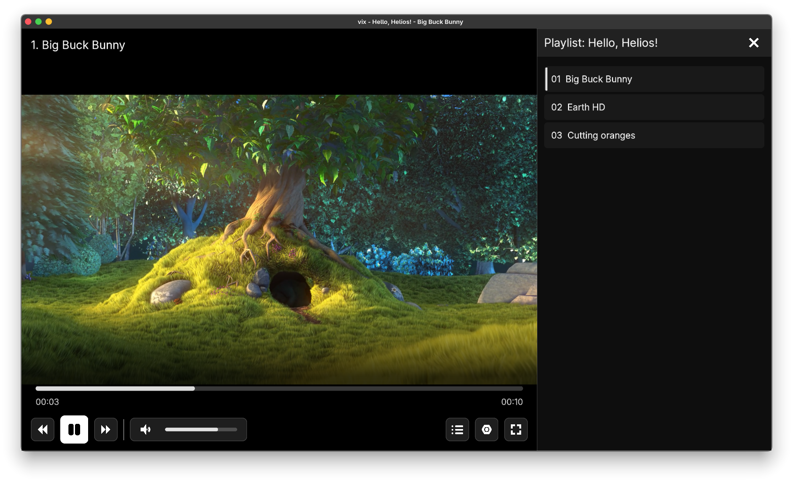

# Helios UI

User interface framework for C++ applications.

> [!WARNING]
> This project is still in development and may contain issues. Documentation is also incomplete. Use at your own risk.

---

*UI frontend for libmpv made with Helios, featuring buttons, progress bar, volume control and playlist sidebar.*

## About

Helios UI is a C++ user interface framework designed for building cross-platform applications with a focus on
performance and flexibility. It abstracts away input handling and rendering, allowing you to focus on building your UI
without worrying about platform-specific details.

## Features

- **Cross-platform**: Tested on Windows, Linux, macOS, Android and iOS.
- **Any rendering backend**: (Note: only OpenGL is currently implemented) Can be used with any rendering backend thanks
  to abstract rendering API.
- **Widget-tree**: All UI elements are organized in a hierarchical tree structure.
- **Custom rendering**: Provides a custom rendering system for efficient drawing of UI elements with automatic batching
  and caching.
- **Event handling**: Supports mouse, keyboard, touch and IME input by propagating events through the widget tree.
- **Layout system**: Contains primitives for building flexible and responsive layouts, including Boxes and Linear
  Layouts (heavily influenced by Kotlin Compose).
- **Actions**: Has a simple animation/action system for animating properties of widgets over time.
- **Unicode text rendering**: By utilizing the [tint](https://github.com/prevter/tint) library, which uses FreeType and
  HarfBuzz under the hood, Helios can render complex Unicode text with proper shaping and kerning, supporting a wide
  range of languages and scripts.

## Documentation

**Documentation is planned, but currently not available.**

Explaining in simple terms, main components of the framework are:

- **Helios::Widget**: Base class for all UI elements. Widgets can have child widgets, forming a tree structure. Override
  the `void onDraw(DrawList& dl)` method to send draw commands to the provided `DrawList` for rendering.
- **Helios::Director**: Main class responsible for managing the widget tree, handling input events and coordinating
  rendering. Director is a singleton class, so you can access it with `Helios::Director::get()`. Make sure to initialize
  it after you've set up your rendering context. Use `director.update(dt)` and `director.render()` in your main loop to
  update and render the UI.
- **Helios::Action**: Base class for animations and actions that can be applied to widgets. See static methods of
  `Action` for creating common actions. Use `widget->runAction(action)` to apply an action to a widget.

## Goals and non-goals

The main goal of this project was to create a rendering backend
for [Eclipse Menu](https://github.com/EclipseMenu/EclipseMenu) to render the UI in real-time, while being injected
into Geometry Dash. However, main concepts and architecture allow for more than that (tested in a few personal
projects).

**Goals:**

- Support a wide range of platforms, including mobile and desktop.
- Touch support is a first-class citizen, but mouse and keyboard input should also be supported.
- Simple declarative API for building UI, inspired by Kotlin Compose.
- Efficient rendering with automatic batching and caching (targeting 1-3 draw calls for the entire UI).

**Non-goals:**

- Providing a full set of built-in widgets (buttons, sliders, etc.). While some basic widgets may be added in the
  future, the main focus right now is on providing the building blocks for creating custom widgets and layouts.

# License

This project is licensed under the MIT License. See the [LICENSE](LICENSE) file for details.

# Contributing

Contributions are welcome! If you find a bug or have a feature request, please open an issue.
Feel free to submit pull requests, although note that some things may be in flux right now as the project is still in
early development. Make sure to follow the existing code style.

# Acknowledgements

- [tint](https://github.com/prevter/tint): Unicode text rendering toolkit (made by me :P)
    - [FreeType](https://www.freetype.org/): Font rendering library
    - [HarfBuzz](https://github.com/harfbuzz/harfbuzz): Text shaping library
    - [msdf-atlas-gen](https://github.com/Chlumsky/msdf-atlas-gen): Used for MSDF/MTSDF font atlas generation
- [{fmt}](https://github.com/fmtlib/fmt): String formatting
- [Dear ImGui](https://github.com/ocornut/imgui): Used for DevTools interface
- [glad](https://glad.dav1d.de/): OpenGL function loading